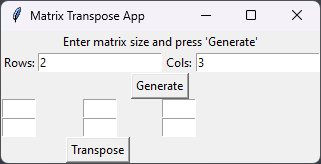
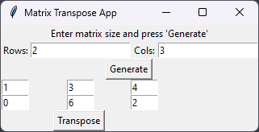

# Matrix Transpose App

This Python application allows you to transpose matrices of arbitrary size. Transposing a matrix involves flipping the matrix over its diagonal; the rows become columns and the columns become rows.

## Features

- Transpose matrices of any size.
- Accepts matrices as input in various formats.
- Outputs the transposed matrix in a readable format.

## Installation

1. Clone the repository to your local machine:

```bash
git clone https://github.com/chedug/matrix-transpose-app.git
```

2. Navigate to the project directory:

```bash
cd matrix-transpose-app
```

## Usage
1. Run the `transpose_converter.py` script:
```bash
python transpose_converter.py 
```

2. Specify the number of rows and columns for you input matrix


3. For this example we will use 2 by 3 matrix. Press Generate



4. In the empty cells, fill in the matrix data:



5. Press Transpose:


New window with the matrix transpose pops up